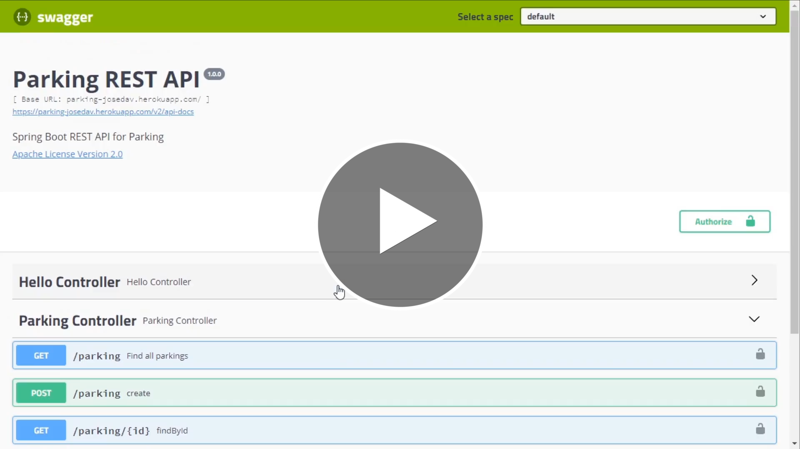

# Desafio-DeploySpring-Dio-SpringFrameworkExperience-Bootcamp
Api para gerenciamento de vagas de estacionamento com deploy - Desafio de Projeto de Spring Framework do Bootcamp Spring Framework Experience, na DIO.

Clique [aqui](https://parking-josedav.herokuapp.com/swagger-ui.html) para testar as rotas: 
As credenciais usadas para autorização são: user - nome do usuário e 12345 - a senha.

  

## Features:
Para isso, ela conta com as rotas de criar, atualizar, listar vagas, recuperar e deletar uma vaga. Além desse CRUD, também tem a rota de registrar a saída de um carro de uma vaga junto com a realização do cálculo do valor com base no tempo que o veículo ficou nessa vaga. Eu também adicionei a esse projeto ao escrever os testes do CRUD junto ao teste do serviço de calcular o valor da vaga.
A aplicação também conta com autorização e autenticação de usuários com Spring Security.

Clique [aqui](https://parking-josedav.herokuapp.com/swagger-ui.html) para testar as rotas: 
As credenciais usadas para autorização são: user - nome do usuário e 12345 - a senha.

Sintam-se livres para dar feedback e/ou contribuir.
